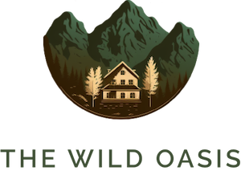

<div align="center">

# 🌴 **The Wild Oasis** 🌴



---

## ✨ [Live Demo](https://my-wild-oasis-hub.netlify.app/)✨

<p align="center">
  <strong>Experience the future of hotel management</strong><br>
  👉 <a href="https://my-wild-oasis-hub.netlify.app/">Try the live demo</a> 👈
</p>

<!--<p align="center">-->
<!--    -->
<!--</p>-->

### Demo Credentials

📧 Email: `demo1@demo1.com`  
🔑 Password: `demo@1234`

---

🚧 **Current Status**: _Under Development_ 🚧

</div>

---

## 📌 **Project Description**

- **User Authentication**: Secure access for admins and employees.
- **Cabin Management**: Easily manage cabins with the ability to add, edit, and remove details.
- **Booking Tracking**: Stay updated with all bookings in real-time.
- **Guest Information Management**: Seamless handling of guest details.

---

## ✨ **Features**

## 🏠 **Cabin Management**

- Employees can **create, read, update, and delete** cabin information, including images.
- Adjust cabin details to meet company requirements effectively.
- **Filter Cabins**:
  - View cabins by status: **with discounts**, **without discounts**, or **all cabins**.
- **Sort Cabins**:
  - **By Name**: Ascending or descending order.
  - **By Capacity**: Ascending or descending order.
  - **By Price**: Ascending or descending order.
  - **By Discount**: Ascending or descending order.

---

## 🔖 **Booking Management**

- **Filter Bookings**:
  - View bookings based on status: **all**, **checked out**, **checked in**, or **unconfirmed**.
- **Sort Bookings**:
  - **By Date**: Ascending (earliest first) or descending (latest first).
  - **By Amount**: Ascending (lowest first) or descending (highest first).
- **Pagination**: Seamlessly navigate through bookings with paginated results.
- **Check-In & Check-Out Booking**: Streamlined process to check in & check out guests.
- **Optional Add-Ons**: Add breakfasts or extras to bookings effortlessly.
- **Delete Bookings**: Remove outdated or canceled bookings with a single click.

## 🔏 **Authentication & Authorization**

- **Employee signup**: Existing employee can sign up new employees.
- **Login & Logout**: Employees can securely log in and out using email and password.
- **Account Updates**: Employees can edit their profile details, including photos, names, and passwords.

## 📅 **Booking Rules**

- Admins can configure the following booking rules:
  - Maximum guests allowed per booking.
  - Maximum nights permitted for a booking.
  - Maximum price set for breakfast.

---

## ☕ **Dark Mode**

- Toggle Dark Mode: Users can switch between light and dark themes for an enhanced user experience.

---

## 🛠️ **Technologies Used**

- **Frontend**: React.js, Context API, React Router, React Query, React Hook Form, Styled Components, React Icons, React Hot Toast, ErrorBoundary
- **Backend**: Supabase
- **Database**: Supabase (PostgreSQL)
- **Deployment**: Netlify

---

## 🚀 **Getting Started**

### 📦 **Installation**

1. Clone the repository:

   ```bash
   git clone https://github.com/Varunkmr481/The-Wild-Oasis.git
   ```

2. Install dependencies:
   ```bash
   cd wild-oasis
   npm install
   ```
3. Start the development server:

   ```bash
   npm run dev
   ```

4. Open [http://localhost:5173](http://localhost:5173) to view it in your browser

---

## 🛡️ **Acknowledgments**

This project is being developed in one of the Jonas Schmedtmann's course on [Udemy](https://www.udemy.com/).

---

<div align="center">

Made with ❤️ while learning from **Jonas Schmedtmann**

</div>
